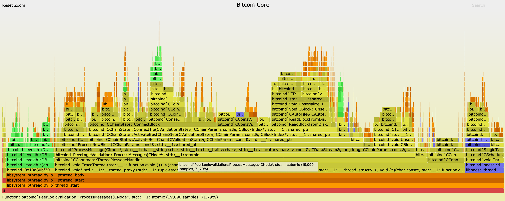

# Flame Graphs

Notes on producing [Flame Graphs](https://github.com/brendangregg/FlameGraph) for Bitcoin Core.

This is based off [some work](https://github.com/eklitzke/bitcoin/blob/flamegraphs/doc/flamegraphs.md) originally done by [Evan Klitzke](https://github.com/eklitzke).

### Colouring 
This directory includes a patch that will colour the graphs such that:
* Yellow - Bitcoin Core
* Blue - Boost
* Green - LevelDB
* Orange - System
* Red - Everything else


### Generating
```bash
# clone the Flame Graph repo
git clone https://github.com/brendangregg/FlameGraph && cd FlameGraph

# apply the bitcoin colouring patch
patch -p1 < path/to/core-review/flamegraph/bitcoin-colour.patch

# run bitcoind
./path/to/src/bitcoind

# capture 120s worth of stackframes using DTrace
# at 99 Hertz for the process named bitcoind
# 
# arg1 is the user-land program counter, so it's checked that it's non-zero.
# arg0 is the kernel.
# more info: http://www.brendangregg.com/FlameGraphs/cpuflamegraphs.html#Instructions
sudo dtrace -x ustackframes=100 \
-n 'profile-99 /execname == "bitcoind" && arg1/ { @[ustack()] = count(); } tick-120s { exit(0); }' \
-o out.stacks

./stackcollapse.pl out.stacks > out.folded
# check ./flamegraph.pl --help for more options
# i.e you prefer your graphs to hang from the ceiling pass --inverted
./flamegraph.pl out.folded --color bitcoin --title "Bitcoin Core" --width 1600 > out.svg

open out.svg
```

You can also filter the stack output before creating the graph:

```bash
./stackcollapse.pl out.stacks | \
grep -i 'ProcessMessage' | \
./flamegraph.pl --color bitcoin --title "Bitcoin Core" --width 1600 > out.svg
```

You should end up with graphs that look similar too this:


