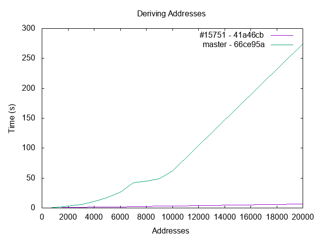

# gnuplot

[gnuplot](http://www.gnuplot.info) is a graphing utility that can generate two and three-dimensional plots.

It can be a useful when reviewing benchmarking / speedup related PRs, like [#15751](https://github.com/bitcoin/bitcoin/pull/15751).

Using the data in [`col.csv`](col.csv), which was collected using `bitcoind` RPC calls like:
```bash
time src/bitcoin-cli deriveaddresses "wsh(multi(1,xpub661MyMwAqRbcFW31YEwpkMuc5THy2PSt5bDMsktWQcFF8syAmRUapSCGu8ED9W6oDMSgv6Zz8idoc4a6mr8BDzTJY47LJhkJ8UB7WEGuduB/1/0/*,xpub69H7F5d8KSRgmmdJg2KhpAK8SR3DjMwAdkxj3ZuxV27CprR9LgpeyGmXUbC6wb7ERfvrnKZjXoUmmDznezpbZb7ap6r1D3tgFxHmwMkQTPH/0/0/*))#t2zpj2eu" "[0,1000]"
```

```bash
# addresses | #15751 (s) | master (s)
100, 0.059, 0.058
500, 0.188, 0.314
1000, 0.355, 0.899
2000, 0.70, 2.953
< snip >
```

Open `gnuplot` and configure and generate a .`png`:
```bash
gnuplot

set term png
set output 'deriving.png'
set title 'Deriving Addresses'
set xlabel 'Addresses'
set ylabel 'Time (s)'
plot 'col.csv' using 1:2 title '#15751 - 41a46cb' with lines, \
    'col.csv' using 1:3 title 'master - 66ce95a' with lines
```


