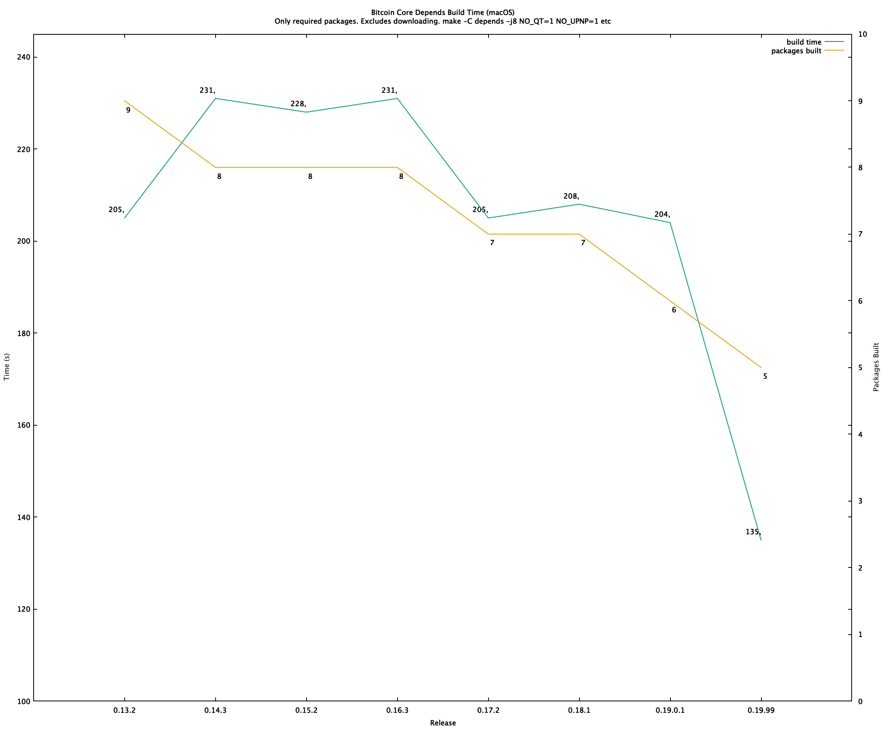
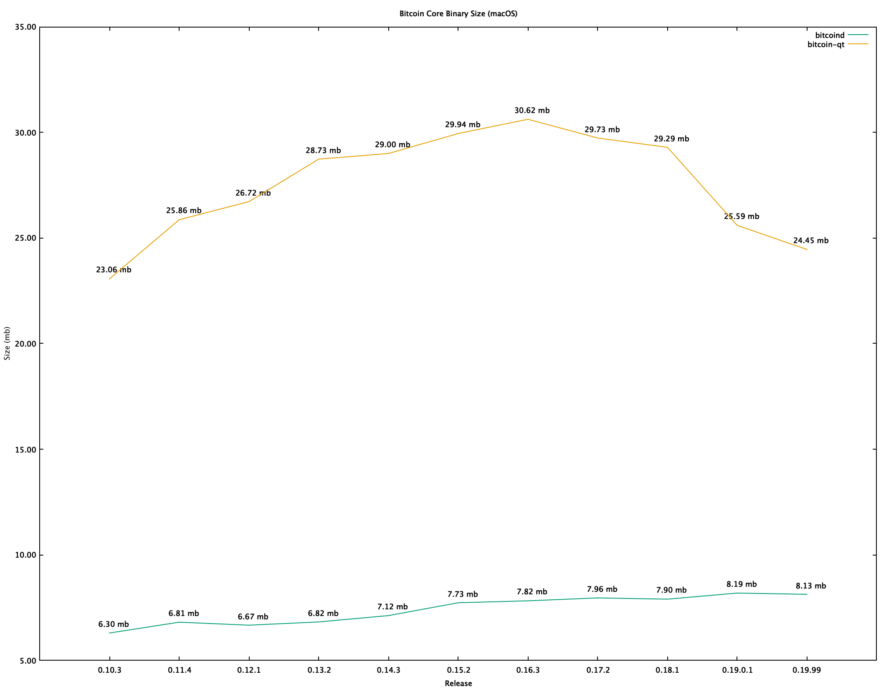

# gnuplot

[gnuplot](http://www.gnuplot.info) is a graphing utility that can generate two and three-dimensional plots.

Useful for reviewing benchmarking / speedup related PRs, like [#15751](https://github.com/bitcoin/bitcoin/pull/15751).

Using the data in [`col.csv`](col.csv), which was collected using `bitcoind` RPC calls like:
```bash
time src/bitcoin-cli deriveaddresses "wsh(multi(1,xpub661MyMwAqRbcFW31YEwpkMuc5THy2PSt5bDMsktWQcFF8syAmRUapSCGu8ED9W6oDMSgv6Zz8idoc4a6mr8BDzTJY47LJhkJ8UB7WEGuduB/1/0/*,xpub69H7F5d8KSRgmmdJg2KhpAK8SR3DjMwAdkxj3ZuxV27CprR9LgpeyGmXUbC6wb7ERfvrnKZjXoUmmDznezpbZb7ap6r1D3tgFxHmwMkQTPH/0/0/*))#t2zpj2eu" "[0,1000]"
```

```bash
# addresses | #15751 (s) | master (s)
100, 0.059, 0.058
500, 0.188, 0.314
1000, 0.355, 0.899
2000, 0.70, 2.953
< snip >
```

Open `gnuplot` and configure and generate a .`png`:
```bash
gnuplot

set term png
set output 'deriving.png'
set title 'Deriving Addresses'
set xlabel 'Addresses'
set ylabel 'Time (s)'
plot 'col.csv' using 1:2 title '#15751 - 41a46cb' with lines, \
    'col.csv' using 1:3 title 'master - 66ce95a' with lines
```


### depends build timing

```bash
set title noenhanced
set title "Bitcoin Core Depends Build Time (macOS)\nOnly required packages. Excludes downloading. make -C depends -j8 NO_QT=1 NO_UPNP=1 etc"
set xlabel 'Release'

set xrange [0:9]
set xtics ('0.13.2' 1, '0.14.3' 2, '0.15.2' 3, '0.16.3' 4, '0.17.2' 5, '0.18.1' 6, '0.19.0.1' 7,  '0.19.99' 8)

set ylabel 'Time (s)'
set yrange [100:245]

set y2range [0:10]
set y2tics 1
set y2label 'Packages Built'

plot 'depends.csv' using 1:2:($2) with labels offset char -2,1 notitle, \
'depends.csv' using 1:2 title 'build time' with lines, \
'depends.csv' using 1:3:($3) with labels offset char 1,-1 notitle axes x1y2, \
'depends.csv' using 1:3 title 'packages built' with line axes x1y2
```



### bitcoind / qt file size

```bash
set title 'Bitcoin Core Binary Size (macOS)'

set xlabel 'Release'
set xrange [0:12]
set xtics ('0.10.3' 1, '0.11.4' 2, '0.12.1' 3, '0.13.2' 4, '0.14.3' 5, '0.15.2' 6, '0.16.3' 7, '0.17.2' 8, '0.18.1' 9, '0.19.0.1' 10,  '0.19.99' 11)

set ylabel 'Size (mb)'
set format y '%.2s'

plot 'size.csv' using 1:2:(sprintf("%.2f mb", $2 / 1000000)) with labels offset char 1,1 notitle, \
'size.csv' using 1:2 title 'bitcoind' with lines, \
'size.csv' using 1:3:(sprintf("%.2f mb", $3 / 1000000)) with labels offset char 1,1 notitle, \
'size.csv' using 1:3 title 'bitcoin-qt' with line

set title 'Bitcoin Core dylib Count (macOS)'
set yrange [0:20]

plot 'dylib.csv' using 1:2:('2') with labels offset char 1,1 notitle, \
'dylib.csv' using 1:2 title 'bitcoind' with lines, \
'dylib.csv' using 1:3:($3) with labels offset char 1,1 notitle, \
'dylib.csv' using 1:3 title 'bitcoin-qt' with line
```

