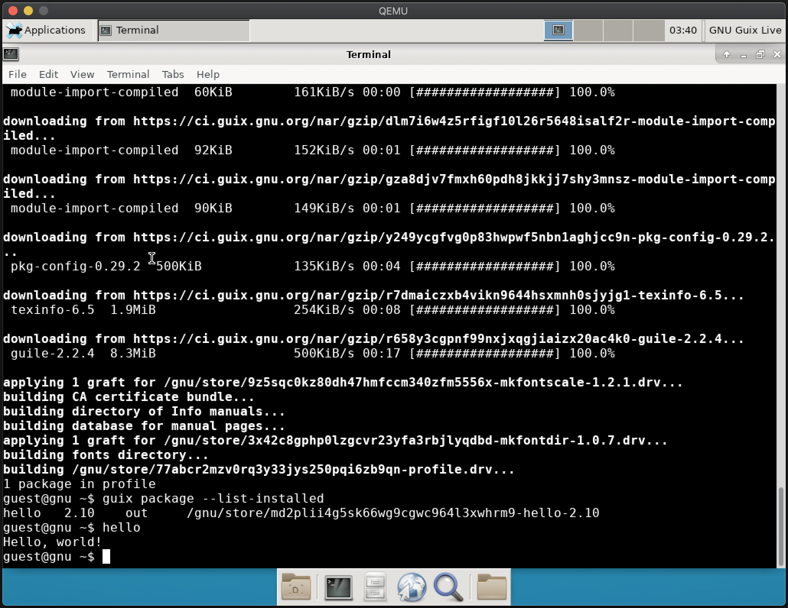

# Guix VM Image (using QEMU)

QEMU is required, it can be installed using `brew`:
```bash
brew install qemu
```

Download and unpack the latest Guix system image:
```bash
export GUIX_VERSION=1.1.0

wget https://ftp.gnu.org/gnu/guix/guix-system-vm-image-${GUIX_VERSION}.x86_64-linux.xz
unxz -d --threads=4 guix-system-vm-image-${GUIX_VERSION}.x86_64-linux.xz
```

Run and login with `root`:
```bash
qemu-system-x86_64 -smp cores=4 -net user -net nic,model=virtio -m 2048 guix-system-vm-image-${GUIX_VERSION}.x86_64-linux
```

Update Guix and any installed packages:
```bash
guix pull --max-jobs=4
guix package -u
guix --version
```

Test installing the `hello` package:
```bash
guix package --install hello

guix package --list-installed

# Run hello
hello
```

🍻


